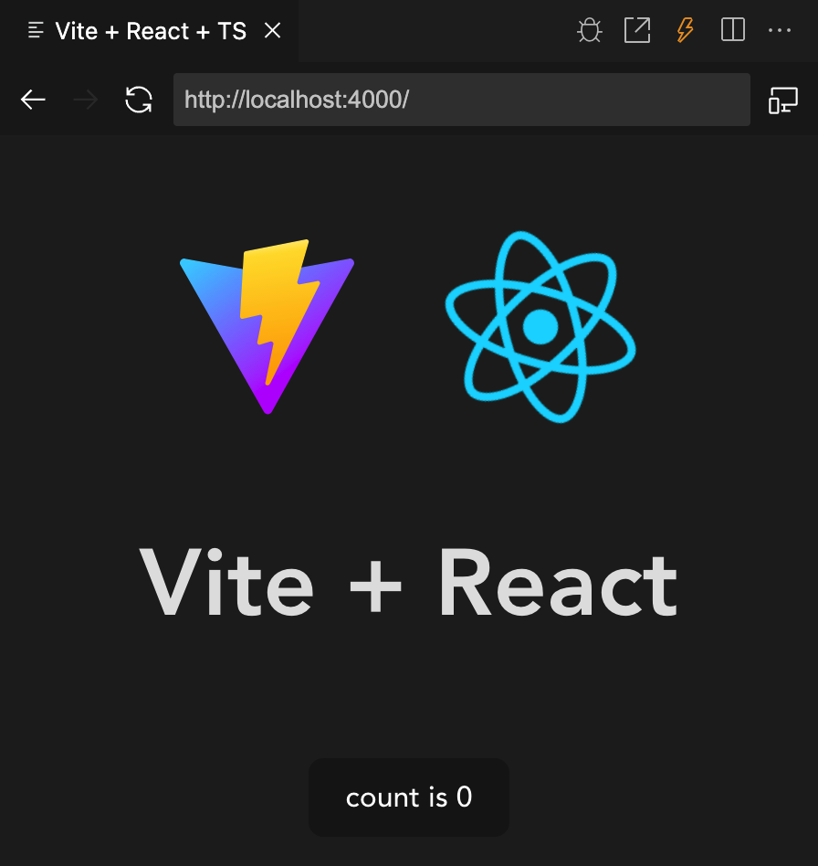
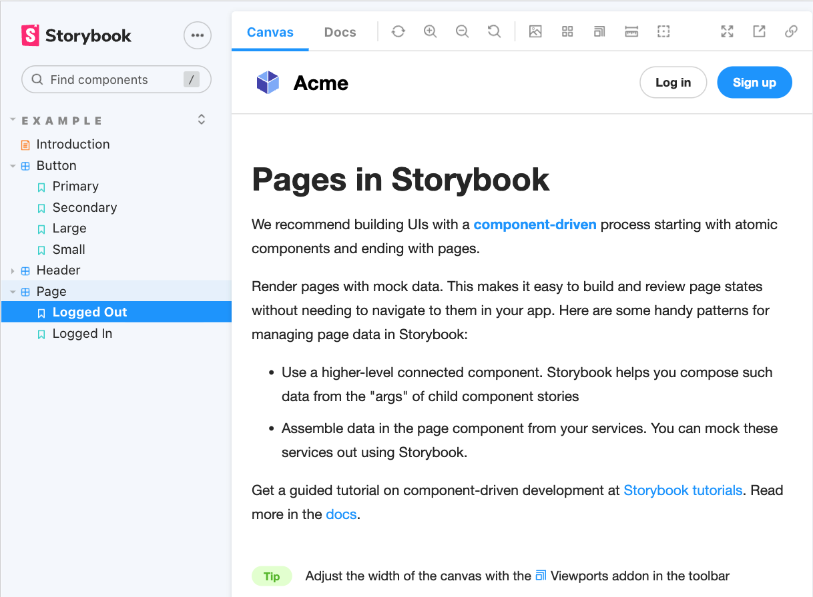

# A design system and component library

This repro has been started to create a component library, to be documented in a storybook, and to 
add guidelines for a design system.

This react project is created using

> yarn create vite NAME --template react-ts

When Visual Studio Code is started using

> code .

Vite will automatically start and open up in a vsc window: 

  

To start the storybook and open it on localhost, run:

> yarn storybook

